# https://www.github.com/RobertAKARobin/diffshot 
> This commit history created using [Diffshot](https://github.com/RobertAKARobin/diffshot)

## Table of Contents
- [c9184e1: First version](#first-version)
  - [diffshot.sh](#first-version-diffshotsh)
- [e37d7b4: Extracted to separate methods](#extracted-to-separate-methods)
  - [diffshot.sh](#extracted-to-separate-methods-diffshotsh)
- [b934b45: Dont look for ---](#dont-look-for----)
  - [diffshot.sh](#dont-look-for-----diffshotsh)
- [9b93c02: Went back to using while loops](#went-back-to-using-while-loops)
  - [diffshot.sh](#went-back-to-using-while-loops-diffshotsh)
- [8f3720f: Moved weird config settings to beginning of script](#moved-weird-config-settings-to-beginning-of-script)
  - [diffshot.sh](#moved-weird-config-settings-to-beginning-of-script-diffshotsh)
- [0296ae6: Added README](#added-readme)
  - [README.md](#added-readme-readmemd)
- [1ec1472: Added more quote escaping](#added-more-quote-escaping)
  - [diffshot.sh](#added-more-quote-escaping-diffshotsh)
- [83d8afb: Ignored binary files](#ignored-binary-files)
  - [diffshot.sh](#ignored-binary-files-diffshotsh)
- [1dc0acb: Exports commit history md](#exports-commit-history-md)
  - [diffshot.sh](#exports-commit-history-md-diffshotsh)
- [26ab587: Added commit history and diffshots](#added-commit-history-and-diffshots)
  - [commit_history.md](#added-commit-history-and-diffshots-commit_historymd)
- [30085eb: Fixed backslash escaping](#fixed-backslash-escaping)
  - [commit_history.md](#fixed-backslash-escaping-commit_historymd)
  - [diffshot.sh](#fixed-backslash-escaping-diffshotsh)
- [f00e185: Changed name of markdown and folder](#changed-name-of-markdown-and-folder)
  - [_DIFFSHOTS.md](#changed-name-of-markdown-and-folder-_diffshotsmd)
  - [diffshot.sh](#changed-name-of-markdown-and-folder-diffshotsh)
- [0e502ee: Added hash and crediting](#added-hash-and-crediting)
  - [_DIFFSHOTS.md](#added-hash-and-crediting-_diffshotsmd)
  - [diffshot.sh](#added-hash-and-crediting-diffshotsh)
- [29c07c9: Includes Github links](#includes-github-links)
  - [_DIFFSHOTS.md](#includes-github-links-_diffshotsmd)
  - [diffshot.sh](#includes-github-links-diffshotsh)
- [8b93756: Better formatting on markdown file](#better-formatting-on-markdown-file)
  - [_DIFFSHOTS.md](#better-formatting-on-markdown-file-_diffshotsmd)
  - [diffshot.sh](#better-formatting-on-markdown-file-diffshotsh)
- [fcf0833: Added link to example](#added-link-to-example)
  - [README.md](#added-link-to-example-readmemd)
- [0dc1e06: Added table of contents](#added-table-of-contents)
  - [README.md](#added-table-of-contents-readmemd)
  - [_DIFFSHOTS.md](#added-table-of-contents-_diffshotsmd)
  - [diffshot.sh](#added-table-of-contents-diffshotsh)

# First version

> [c9184e1](https://www.github.com/RobertAKARobin/diffshot/commit/c9184e1)

### [First version: `diffshot.sh`](https://www.github.com/RobertAKARobin/diffshot/blob/c9184e1/diffshot.sh)
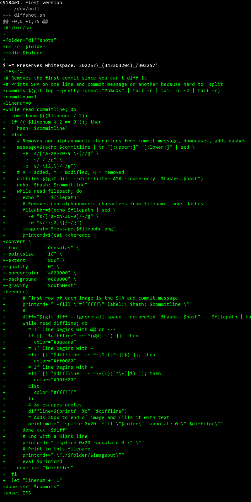

# Extracted to separate methods

> [e37d7b4](https://www.github.com/RobertAKARobin/diffshot/commit/e37d7b4)

### [Extracted to separate methods: `diffshot.sh`](https://www.github.com/RobertAKARobin/diffshot/blob/e37d7b4/diffshot.sh)

# Dont look for ---

> [b934b45](https://www.github.com/RobertAKARobin/diffshot/commit/b934b45)

### [Dont look for ---: `diffshot.sh`](https://www.github.com/RobertAKARobin/diffshot/blob/b934b45/diffshot.sh)
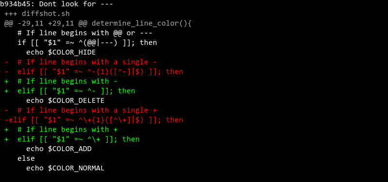

# Went back to using while loops

> [9b93c02](https://www.github.com/RobertAKARobin/diffshot/commit/9b93c02)

### [Went back to using while loops: `diffshot.sh`](https://www.github.com/RobertAKARobin/diffshot/blob/9b93c02/diffshot.sh)
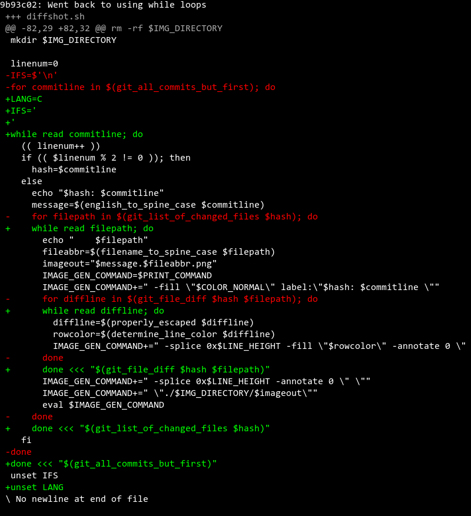

# Moved weird config settings to beginning of script

> [8f3720f](https://www.github.com/RobertAKARobin/diffshot/commit/8f3720f)

### [Moved weird config settings to beginning of script: `diffshot.sh`](https://www.github.com/RobertAKARobin/diffshot/blob/8f3720f/diffshot.sh)
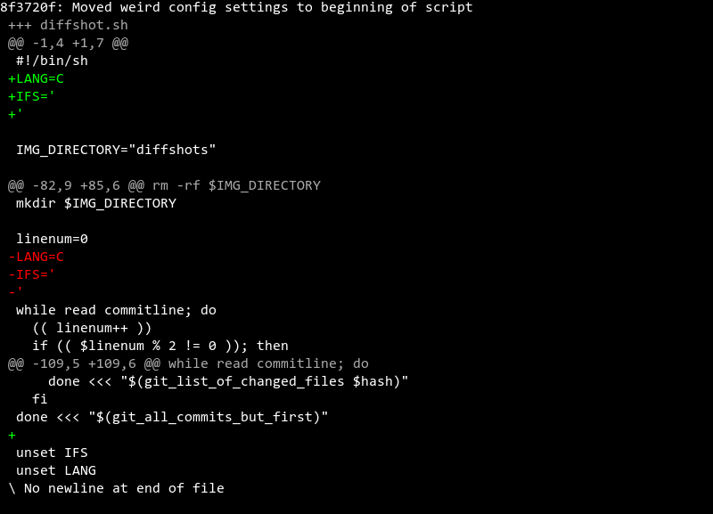

# Added README

> [0296ae6](https://www.github.com/RobertAKARobin/diffshot/commit/0296ae6)

### [Added README: `README.md`](https://www.github.com/RobertAKARobin/diffshot/blob/0296ae6/README.md)
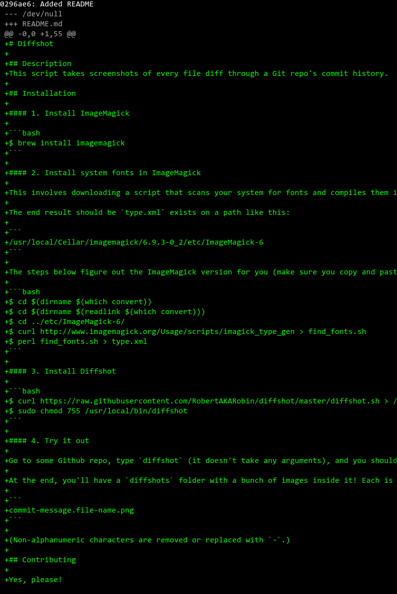

# Added more quote escaping

> [1ec1472](https://www.github.com/RobertAKARobin/diffshot/commit/1ec1472)

### [Added more quote escaping: `diffshot.sh`](https://www.github.com/RobertAKARobin/diffshot/blob/1ec1472/diffshot.sh)
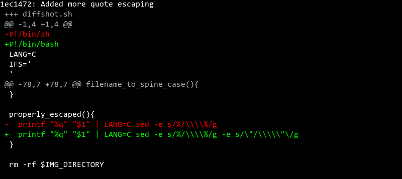

# Ignored binary files

> [83d8afb](https://www.github.com/RobertAKARobin/diffshot/commit/83d8afb)

### [Ignored binary files: `diffshot.sh`](https://www.github.com/RobertAKARobin/diffshot/blob/83d8afb/diffshot.sh)
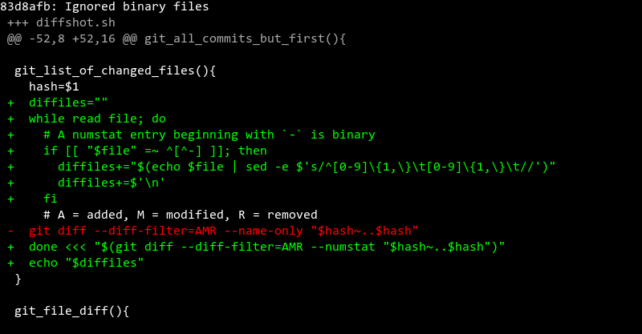

# Exports commit history md

> [1dc0acb](https://www.github.com/RobertAKARobin/diffshot/commit/1dc0acb)

### [Exports commit history md: `diffshot.sh`](https://www.github.com/RobertAKARobin/diffshot/blob/1dc0acb/diffshot.sh)
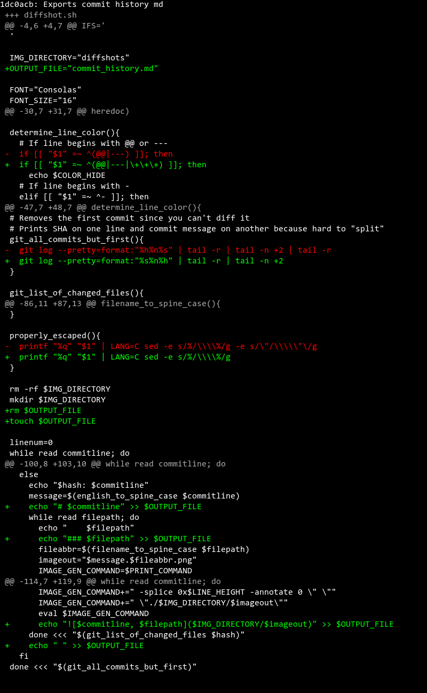

# Added commit history and diffshots

> [26ab587](https://www.github.com/RobertAKARobin/diffshot/commit/26ab587)

### [Added commit history and diffshots: `commit_history.md`](https://www.github.com/RobertAKARobin/diffshot/blob/26ab587/commit_history.md)
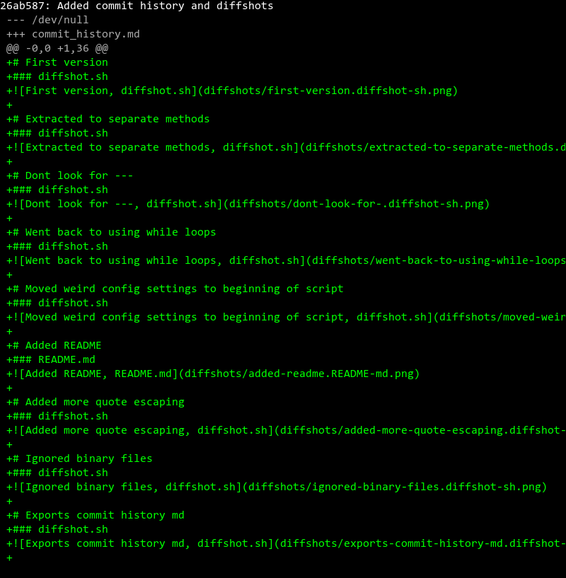

# Fixed backslash escaping

> [30085eb](https://www.github.com/RobertAKARobin/diffshot/commit/30085eb)

### [Fixed backslash escaping: `commit_history.md`](https://www.github.com/RobertAKARobin/diffshot/blob/30085eb/commit_history.md)
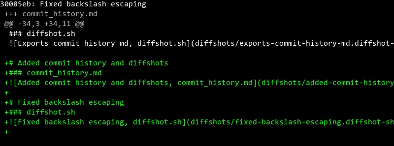

### [Fixed backslash escaping: `diffshot.sh`](https://www.github.com/RobertAKARobin/diffshot/blob/30085eb/diffshot.sh)
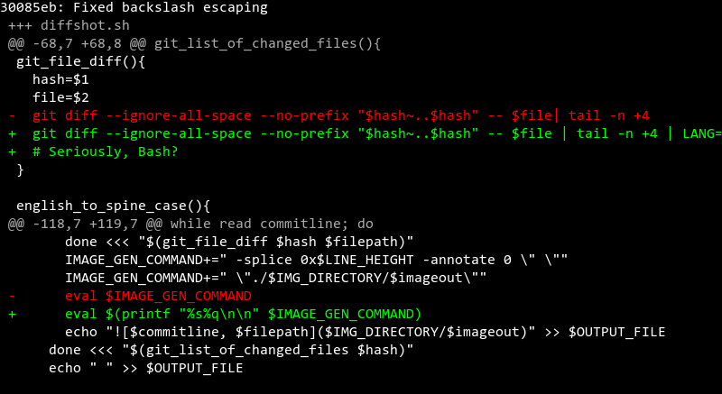

# Changed name of markdown and folder

> [f00e185](https://www.github.com/RobertAKARobin/diffshot/commit/f00e185)

### [Changed name of markdown and folder: `_DIFFSHOTS.md`](https://www.github.com/RobertAKARobin/diffshot/blob/f00e185/_DIFFSHOTS.md)
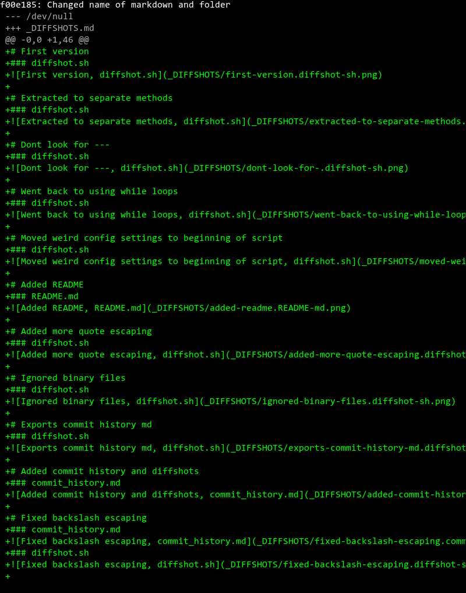

### [Changed name of markdown and folder: `diffshot.sh`](https://www.github.com/RobertAKARobin/diffshot/blob/f00e185/diffshot.sh)
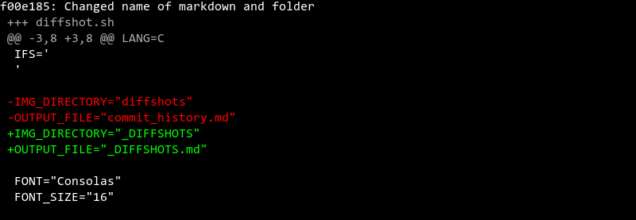

# Added hash and crediting

> [0e502ee](https://www.github.com/RobertAKARobin/diffshot/commit/0e502ee)

### [Added hash and crediting: `_DIFFSHOTS.md`](https://www.github.com/RobertAKARobin/diffshot/blob/0e502ee/_DIFFSHOTS.md)
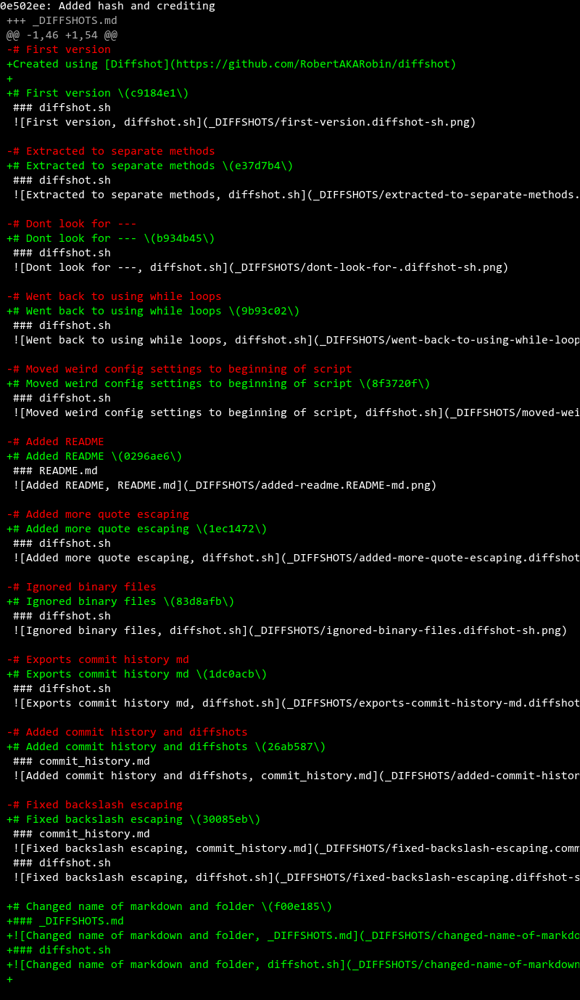

### [Added hash and crediting: `diffshot.sh`](https://www.github.com/RobertAKARobin/diffshot/blob/0e502ee/diffshot.sh)
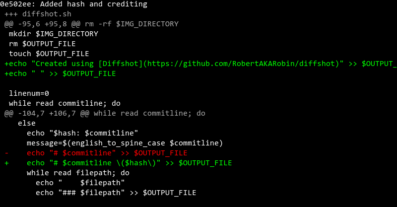

# Includes Github links

> [29c07c9](https://www.github.com/RobertAKARobin/diffshot/commit/29c07c9)

### [Includes Github links: `_DIFFSHOTS.md`](https://www.github.com/RobertAKARobin/diffshot/blob/29c07c9/_DIFFSHOTS.md)
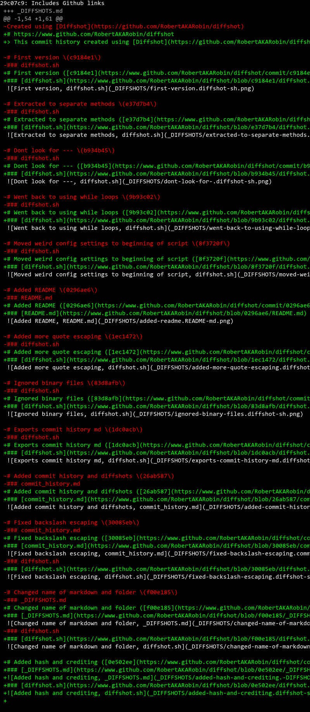

### [Includes Github links: `diffshot.sh`](https://www.github.com/RobertAKARobin/diffshot/blob/29c07c9/diffshot.sh)
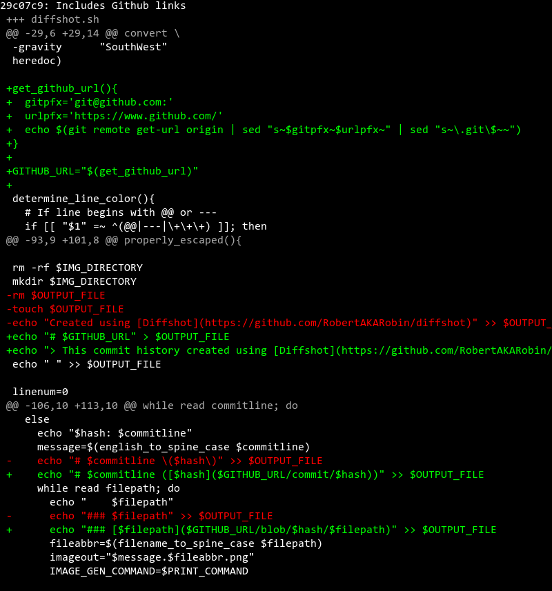

# Better formatting on markdown file

> [8b93756](https://www.github.com/RobertAKARobin/diffshot/commit/8b93756)

### [Better formatting on markdown file: `_DIFFSHOTS.md`](https://www.github.com/RobertAKARobin/diffshot/blob/8b93756/_DIFFSHOTS.md)
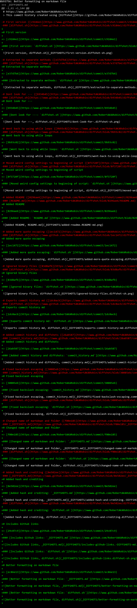

### [Better formatting on markdown file: `diffshot.sh`](https://www.github.com/RobertAKARobin/diffshot/blob/8b93756/diffshot.sh)
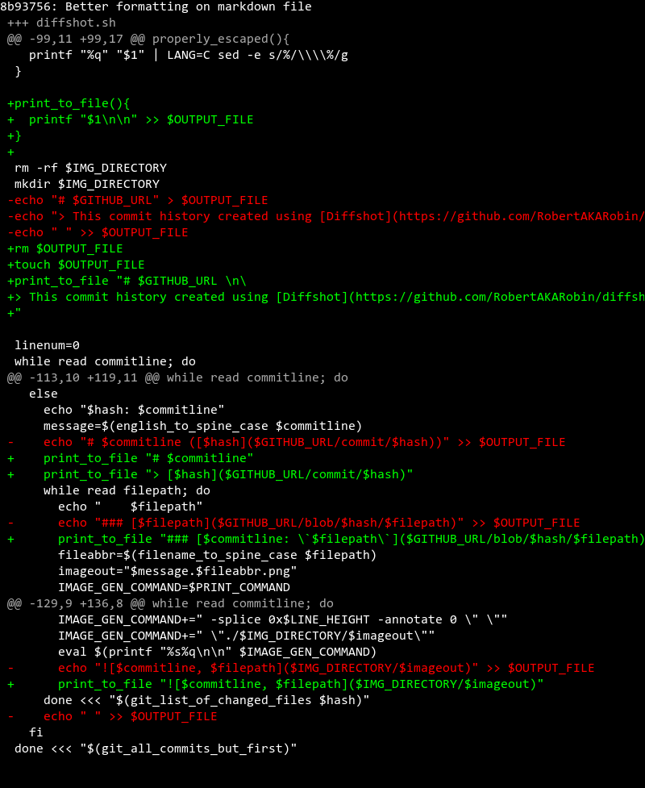

# Added link to example

> [fcf0833](https://www.github.com/RobertAKARobin/diffshot/commit/fcf0833)

### [Added link to example: `README.md`](https://www.github.com/RobertAKARobin/diffshot/blob/fcf0833/README.md)
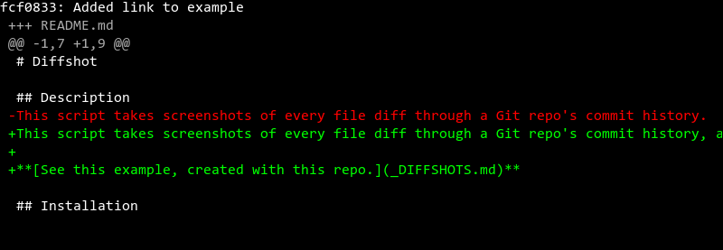

# Added table of contents

> [0dc1e06](https://www.github.com/RobertAKARobin/diffshot/commit/0dc1e06)

### [Added table of contents: `README.md`](https://www.github.com/RobertAKARobin/diffshot/blob/0dc1e06/README.md)
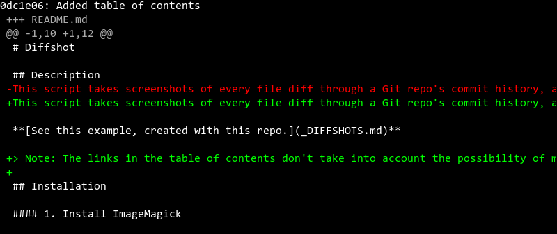

### [Added table of contents: `_DIFFSHOTS.md`](https://www.github.com/RobertAKARobin/diffshot/blob/0dc1e06/_DIFFSHOTS.md)
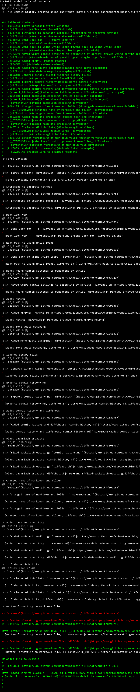

### [Added table of contents: `diffshot.sh`](https://www.github.com/RobertAKARobin/diffshot/blob/0dc1e06/diffshot.sh)
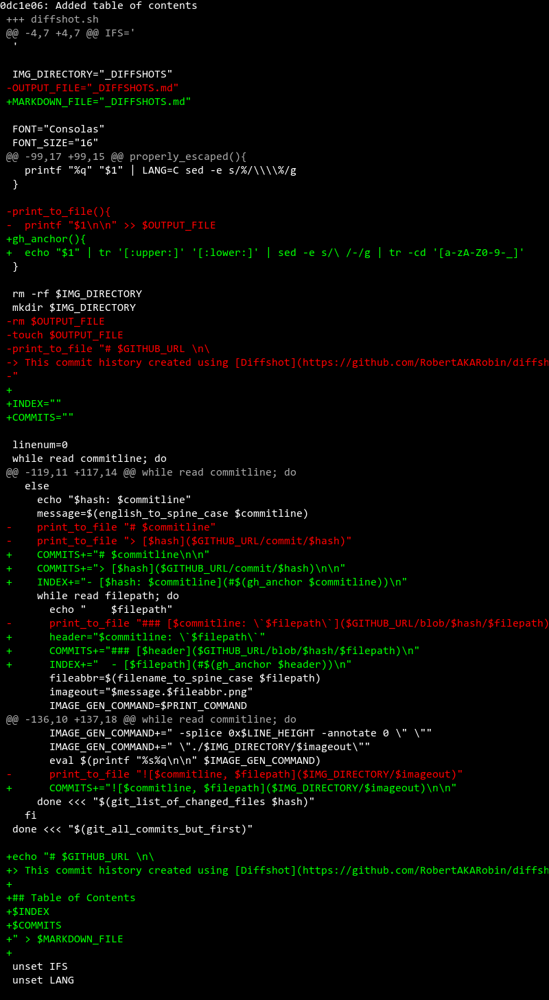

