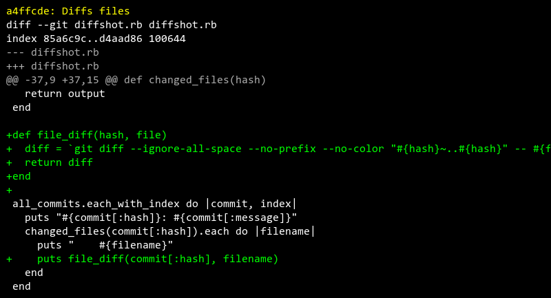

# https://www.github.com/RobertAKARobin/diffshot

> This commit history created using [Diffshot](https://github.com/RobertAKARobin/diffshot)

## Table of Contents

- [c2b152e: Added config.yml](#added-configyml)
    - [config.yml](#added-configyml-configyml)
    - [diffshot.rb](#added-configyml-diffshotrb)
- [ae9a1aa: Shows all commits](#shows-all-commits)
    - [diffshot.rb](#shows-all-commits-diffshotrb)
- [33705a5: Gets Github URL](#gets-github-url)
    - [diffshot.rb](#gets-github-url-diffshotrb)
- [b5138ed: Prints diffed files](#prints-diffed-files)
    - [diffshot.rb](#prints-diffed-files-diffshotrb)
- [a4ffcde: Diffs files](#diffs-files)
    - [diffshot.rb](#diffs-files-diffshotrb)
- [456d406: Prints line color](#prints-line-color)
    - [diffshot.rb](#prints-line-color-diffshotrb)
- [e887de7: Successfully generates the images](#successfully-generates-the-images)
    - [diffshot.rb](#successfully-generates-the-images-diffshotrb)
- [cafd7cd: Accepts range of commits](#accepts-range-of-commits)
    - [diffshot.rb](#accepts-range-of-commits-diffshotrb)
- [02aac3a: Added border and color options](#added-border-and-color-options)
    - [diffshot.rb](#added-border-and-color-options-diffshotrb)
- [a5a0ea1: Better image names](#better-image-names)
    - [diffshot.rb](#better-image-names-diffshotrb)
- [b4f9f34: Generates markdown file](#generates-markdown-file)
    - [diffshot.rb](#generates-markdown-file-diffshotrb)
- [e4f371a: Shows files in initial commit](#shows-files-in-initial-commit)
    - [diffshot.rb](#shows-files-in-initial-commit-diffshotrb)

# Added config.yml
> [c2b152e](https://www.github.com/RobertAKARobin/diffshot/commit/c2b152e)

### [Added config.yml: `config.yml`](https://www.github.com/RobertAKARobin/diffshot/blob/c2b152e/config.yml)

### [Added config.yml: `diffshot.rb`](https://www.github.com/RobertAKARobin/diffshot/blob/c2b152e/diffshot.rb)

# Shows all commits
> [ae9a1aa](https://www.github.com/RobertAKARobin/diffshot/commit/ae9a1aa)

### [Shows all commits: `diffshot.rb`](https://www.github.com/RobertAKARobin/diffshot/blob/ae9a1aa/diffshot.rb)

# Gets Github URL
> [33705a5](https://www.github.com/RobertAKARobin/diffshot/commit/33705a5)

### [Gets Github URL: `diffshot.rb`](https://www.github.com/RobertAKARobin/diffshot/blob/33705a5/diffshot.rb)

# Prints diffed files
> [b5138ed](https://www.github.com/RobertAKARobin/diffshot/commit/b5138ed)

### [Prints diffed files: `diffshot.rb`](https://www.github.com/RobertAKARobin/diffshot/blob/b5138ed/diffshot.rb)

# Diffs files
> [a4ffcde](https://www.github.com/RobertAKARobin/diffshot/commit/a4ffcde)

### [Diffs files: `diffshot.rb`](https://www.github.com/RobertAKARobin/diffshot/blob/a4ffcde/diffshot.rb)

# Prints line color
> [456d406](https://www.github.com/RobertAKARobin/diffshot/commit/456d406)

### [Prints line color: `diffshot.rb`](https://www.github.com/RobertAKARobin/diffshot/blob/456d406/diffshot.rb)

# Successfully generates the images
> [e887de7](https://www.github.com/RobertAKARobin/diffshot/commit/e887de7)

### [Successfully generates the images: `diffshot.rb`](https://www.github.com/RobertAKARobin/diffshot/blob/e887de7/diffshot.rb)

# Accepts range of commits
> [cafd7cd](https://www.github.com/RobertAKARobin/diffshot/commit/cafd7cd)

### [Accepts range of commits: `diffshot.rb`](https://www.github.com/RobertAKARobin/diffshot/blob/cafd7cd/diffshot.rb)

# Added border and color options
> [02aac3a](https://www.github.com/RobertAKARobin/diffshot/commit/02aac3a)

### [Added border and color options: `diffshot.rb`](https://www.github.com/RobertAKARobin/diffshot/blob/02aac3a/diffshot.rb)

# Better image names
> [a5a0ea1](https://www.github.com/RobertAKARobin/diffshot/commit/a5a0ea1)

### [Better image names: `diffshot.rb`](https://www.github.com/RobertAKARobin/diffshot/blob/a5a0ea1/diffshot.rb)

# Generates markdown file
> [b4f9f34](https://www.github.com/RobertAKARobin/diffshot/commit/b4f9f34)

### [Generates markdown file: `diffshot.rb`](https://www.github.com/RobertAKARobin/diffshot/blob/b4f9f34/diffshot.rb)

# Shows files in initial commit
> [e4f371a](https://www.github.com/RobertAKARobin/diffshot/commit/e4f371a)

### [Shows files in initial commit: `diffshot.rb`](https://www.github.com/RobertAKARobin/diffshot/blob/e4f371a/diffshot.rb)

