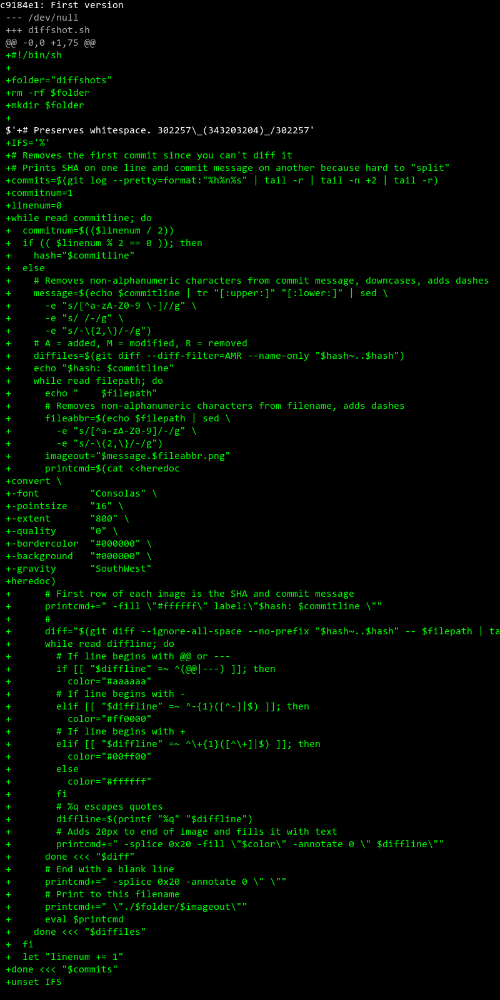
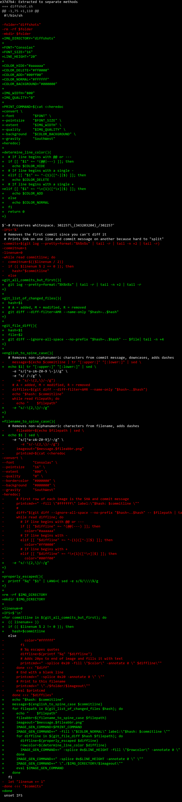
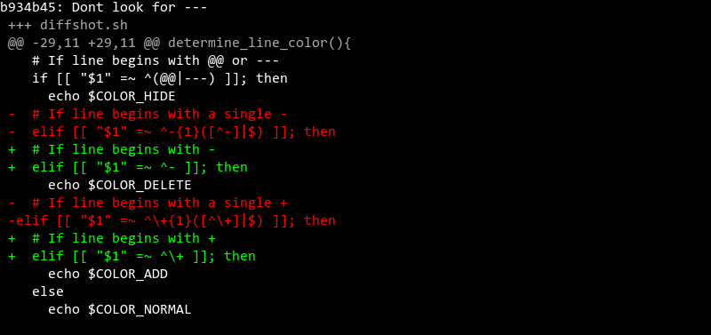
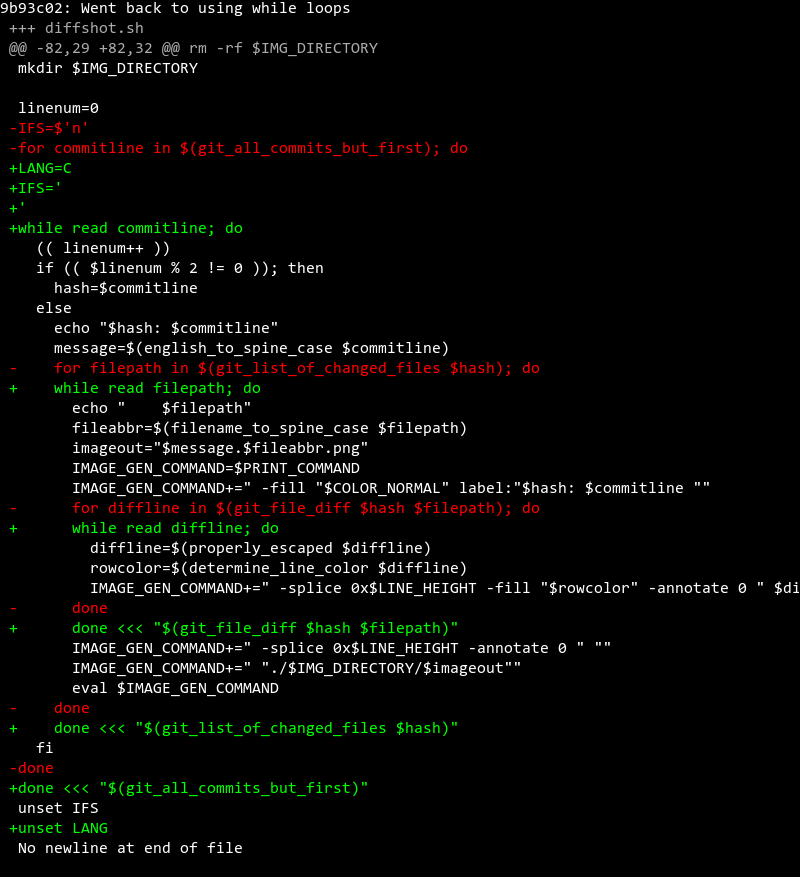
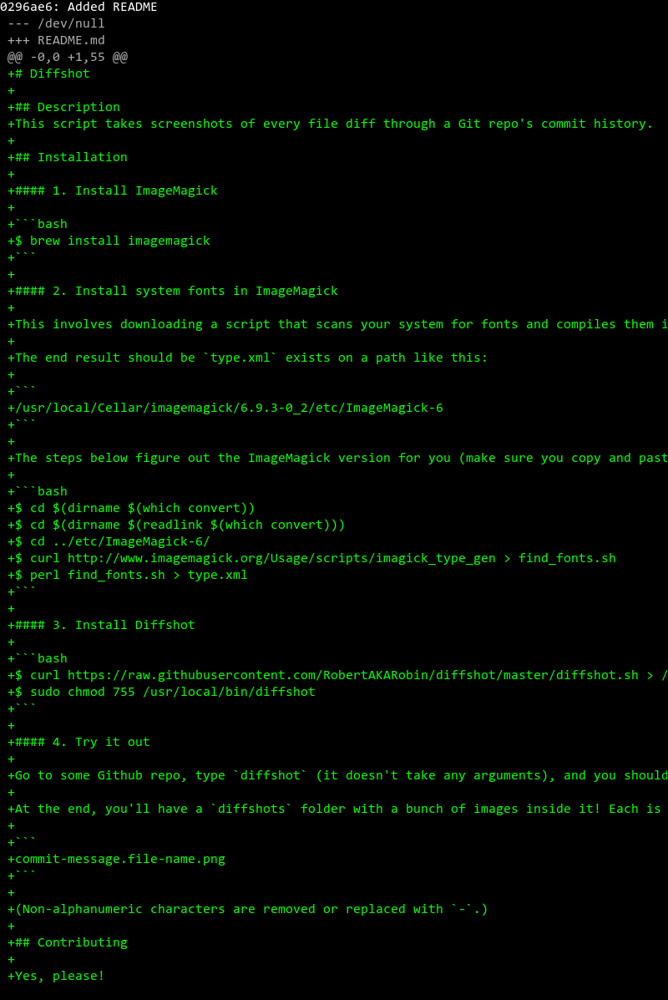
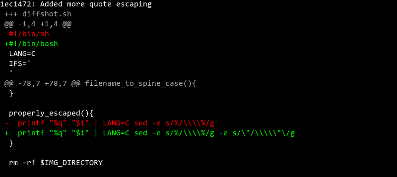
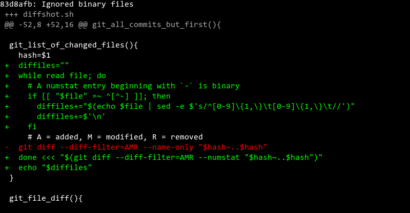
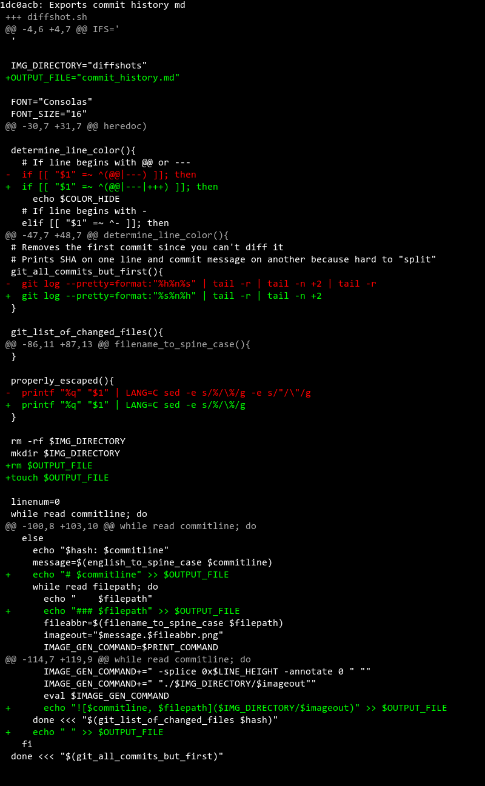
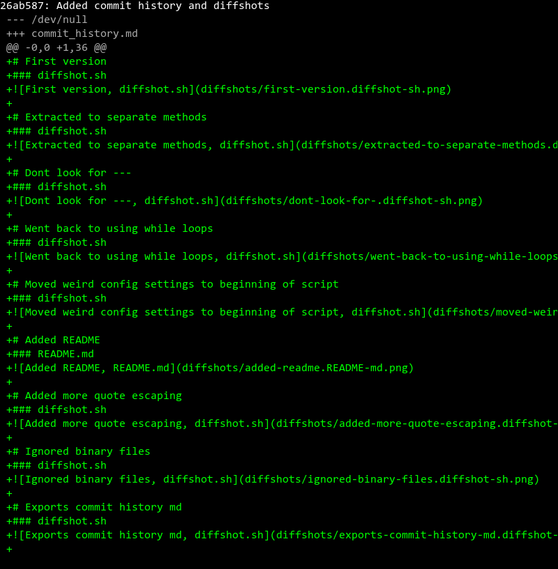

# First version
### diffshot.sh

 
# Extracted to separate methods
### diffshot.sh

 
# Dont look for ---
### diffshot.sh

 
# Went back to using while loops
### diffshot.sh

 
# Moved weird config settings to beginning of script
### diffshot.sh

 
# Added README
### README.md

 
# Added more quote escaping
### diffshot.sh

 
# Ignored binary files
### diffshot.sh

 
# Exports commit history md
### diffshot.sh

 
# Added commit history and diffshots
### commit_history.md

 
# Fixed backslash escaping
### diffshot.sh

 
